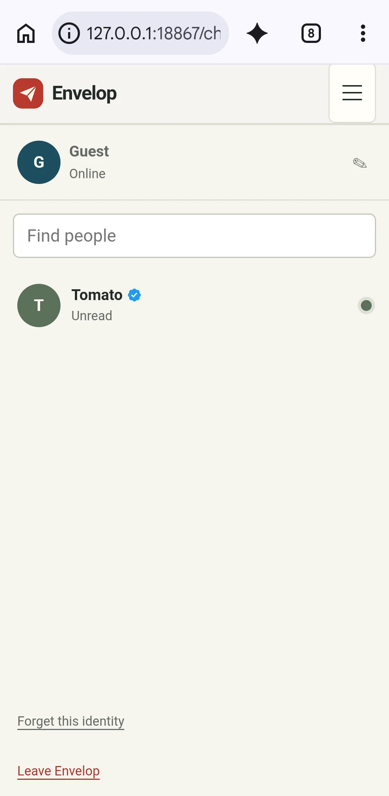

# Envelop

<p>
  <a href="https://github.com/tmarhguy/envelop/actions/workflows/documentation.yml"></a>
  <a href="docs/status.md"></a>
  <a href="docs/platforms.md"></a>
  <a href="protocol/ENVELOP_PROTOCOL.md"></a>
  <a href="docs/platforms.md"></a>
</p>

Envelop lets a person message [Tomato](https://github.com/tmarhguy/tomato), a
32-bit computer built in a dorm. The browser is the general client. A verified
Mac or private Android bridge beside Tomato carries queued traffic over the
nRF8001 BLE UART link to the Envelop app running inside Tomato OS.

<p align="center">
  
</p>
<p align="center"><em>Current mobile web UI on the documented Infinix: deterministic synthetic records, no message sent, and no physical-online claim.</em></p>

```text
person → Envelop web app → backend queue → nearby verified bridge
       → Envelop in Tomato OS → Tomato CPU → labeled reply
```

That path describes the system, not a claim that matching revisions are
currently deployed or online. See the [current status](docs/status.md) for the
evidence boundary.

## What is here

- `website/`: browser chat and explicit Virtual Tomato fallback
- `backend/`: Supabase records, queues, bridge leases, and compute jobs
- `apple/`: macOS 14 operator bridge and test chat client
- `android/core/` and `android/bridge/`: private Android 0.2.0 owner/bridge app
- `protocol/`: binary `ENVELOP/1` framing and shared vectors

There is no supported Windows or iOS native client. The browser is the mobile
and desktop public surface. Native bridge software is maintained for the
operator; the Android APK is privately distributed and must not be linked as a
public download.

## Physical and virtual results

Messaging waits in the backend until a nearby bridge and Tomato acknowledge
it. Hardware compute also uses that leased bridge path. Only a completed
backend hardware result may be labeled **Physical Tomato** or **Hardware
Tomato**.

If hardware is unavailable, the browser may run a separate, visibly labeled
**Virtual Tomato** execution. It is not sent to the FPGA, is not queued for
later physical execution, and must never replace an ambiguous hardware job.
See [architecture](docs/architecture.md) and [platforms](docs/platforms.md).

## Private bridge policy

The BLE radio accepts one physical connection, and the backend allows one
unexpired authenticated bridge lease. A bridge must receive the exact
`ENVELOP/1` Tomato identity before it claims that lease. This is protocol
identity verification, not broad cryptographic attestation.

Bridge accounts are operator-provisioned. Public users do not receive bridge
credentials or native packages. Clients contain only the Supabase HTTPS URL
and public publishable/anonymous key—never a service-role or secret key.
Operational details are in [bridge operations](docs/bridge-operations.md).

## Backend warning

`backend/migrations/001_envelop.sql` is the sole schema and a **destructive
reset**. Applying it drops and recreates Envelop state, including profiles,
conversations, messages, queues, jobs, leases, grants, and ownership records.
Back up anything that must survive, rehearse against a disposable staging
project, and plan owner recovery before touching a hosted project. Follow the
[deployment and recovery runbook](docs/backend-deployment-recovery.md).

## Focused verification

These checks verify source contracts; they do not prove a live BLE session,
deployed backend revision, or programmed FPGA:

```sh
python3 protocol/test-vectors/verify_c.py
swift test --package-path apple
node backend/tests.mjs
cd android && ./gradlew test
```

## Documentation

- [Architecture](docs/architecture.md)
- [Platforms and support](docs/platforms.md)
- [Privacy and data lifecycle](docs/privacy-data-lifecycle.md)
- [Bridge operations](docs/bridge-operations.md)
- [Backend deployment and recovery](docs/backend-deployment-recovery.md)
- [Screenshot policy and catalog](docs/screenshots.md)
- [Windows and iOS retirement](docs/windows-ios-retirement.md)
- [Legal and distribution boundary](docs/legal-distribution.md)
- [Current facts and status](docs/status.md)
- [Documentation authority](docs/documentation-policy.md)
- [Current specification](SPEC.md)
- [Device protocol](protocol/ENVELOP_PROTOCOL.md)

The dated material under [`log/`](log/README.md) records how the project
evolved. It is historical and noncanonical.
