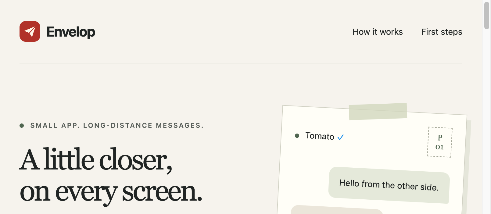

<h1 align="center">Envelop</h1>
<p align="center"><strong>Internet chat room — you, whoever's online, and Tomato, a dorm-built computer.</strong></p>

<p align="center">
  
  
  
  <a href="https://github.com/tmarhguy/tomato"></a>
  
</p>

<p align="center"><em>By Tyrone Marhguy · Computer Engineering ’28</em></p>

People message each other over the Internet — whoever is online, while they're online. [Tomato](https://github.com/tmarhguy/tomato) — a 32-bit computer built in a dorm — joins as a hardware contact through a bridge lease held next to it. Same story as [FramePort](https://github.com/tmarhguy/frameport) bringing Tomato’s HDMI into the editor: put the odd machine on the network without inventing a second product.

This README is the map. [SPEC.md](SPEC.md) is the architecture. [docs/integration.md](docs/integration.md) is the delta between the two.

<p align="center"></p>

<p align="center"><em>Web chat: Tomato is a verified contact on the same network.</em></p>

## Why

Tomato already boots an OS and talks over nRF8001 UART. The messenger is **Envelop** — named for envelopes that carried messages across distance, local BLE text to a phone first, first line for home. The same name now covers the Internet layer: a web chat room where anonymous humans meet while they're online, Tomato pinned and verified at the top, and a leased bridge so one Mac next to the hardware can forward queue traffic until the lease expires or disconnects. Going quiet drops you off the list; leaving wipes your chats for good.

## What works / still open

| Area | Status |
| --- | --- |
| Web chat (presence, DMs, Tomato, rename, admin remove/flush) | Working (`website/chat/`) |
| Mac app = operator bridge console (holds the Tomato lease) | Working |
| Supabase schema, RPCs, RLS, PGlite suite | Working (`backend/migrations/001–004`) |
| ENVELOP/1 Swift + portable C codecs + shared vectors | Working |
| Mac BLE bridge handshake / queue forward / ACK | Live-verified against Tomato hardware at BLE level; holding the lease needs a provisioned bridge account |
| Marketing site, chat-first, no downloads | Working |
| Android Compose + Windows WPF clients | Source only, undistributed |
| iOS client | Source only, undistributed (internet-only by design) |
| Realtime, history paging | Outstanding |
| Acceptance A–E on live hardware | Outstanding |

## Architecture at a glance

| Layer | Role |
| --- | --- |
| `website/` | The app: web chat + marketing, chat-first, no downloads |
| `apple/` | Operator console (Mac holds the BLE bridge) + shared core |
| `android/`, `windows/` | Source only, undistributed |
| `backend/` | Supabase SQL + PGlite tests + smoke script |
| `protocol/`, `tomato/protocol/` | Binary ENVELOP/1 docs and C codec |
| `website/` | Install / download surface |

Composer policy: **Enter sends** on desktop (Shift+Enter for a newline). Mobile keeps a visible **Send** button and an IME Send action.

## Run checks

```sh
swift test --package-path apple
python3 protocol/test-vectors/verify_c.py
node backend/tests.mjs
```

In restricted environments, redirect compiler caches:

```sh
CLANG_MODULE_CACHE_PATH=/tmp/envelop-clang-cache \
SWIFTPM_MODULECACHE_OVERRIDE=/tmp/envelop-swift-cache \
swift test --package-path apple --disable-sandbox
```

Backend setup and bridge grants: [backend/README.md](backend/README.md). Apple packaging: [apple/README.md](apple/README.md) (`apple/package-app.sh` rebuilds `Envelop.app`; `swift test` does not).

Copy `.env.example` → `.env` for live smoke (`backend/smoke-live.sh`). Never commit secrets or service-role keys.

## Repository map

```text
SPEC.md                 frozen target architecture
docs/integration.md     deliberate differences + acceptance tracking
apple/                  SwiftPM app, BLE, codecs, tests
android/                Kotlin Compose client
windows/Envelop/        .NET 8 WPF client
backend/migrations/     001_envelop.sql
protocol/               ENVELOP/1 + BLE contracts + vectors
tomato/protocol/        portable C codec for firmware bring-up
website/                install / download site
media/screenshots/      README plates
```

## Status

This is not a completed Envelop 1.0 release. No store builds are claimed here. Physical BLE (GATT + ENVELOP/1 hello) is verified live against Tomato hardware; holding the bridge lease needs a provisioned bridge account ([backend/README.md](backend/README.md)). The checks above are the truth for this workspace.

## Author

**Tyrone Marhguy** — Computer Engineering '28, [University of Pennsylvania](https://www.upenn.edu/)

[](mailto:tmarhguy@gmail.com)
[](mailto:tmarhguy@engineering.upenn.edu)
[](https://github.com/tmarhguy)
[](https://tomato.tmarhguy.com/)
[](https://twitter.com/marhguy_tyrone)
[](https://instagram.com/tmarhguy)
[](https://substack.com/@tmarhguy)
