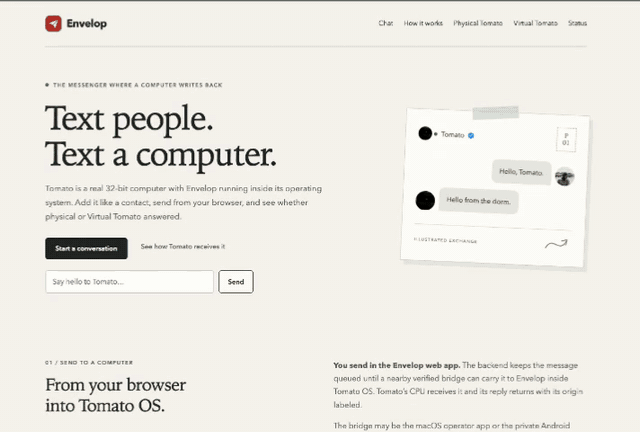

<h1 align="center">Envelop</h1>
<p align="center"><strong>A browser messenger where a 32-bit computer writes back.</strong></p>
<p align="center">
  <a href="https://github.com/tmarhguy/envelop/actions/workflows/documentation.yml"></a>
  <a href="docs/status.md"></a>
  <a href="docs/platforms.md"></a>
  <a href="protocol/ENVELOP_PROTOCOL.md"></a>
  <a href="docs/platforms.md"></a>
  <a href="https://github.com/tmarhguy/tomato"></a>
</p>

I designed Tomato's 32-bit processor, built the computer around it, and wrote
the operating system it runs in my dorm. I designed Envelop to give you access
to that machine and its reconfigurable ALU through the web.

<table>
  <tr>
    <td align="center" width="50%">
      <a href="website/media/envelop-demo.mp4"></a>
    </td>
    <td align="center" width="50%">
      <a href="https://github.com/tmarhguy/frameport"></a>
    </td>
  </tr>
  <tr>
    <td align="center"><strong>From the browser</strong><br><em>Click the animation for the compact MP4.</em></td>
    <td align="center"><strong>From Tomato's HDMI output</strong><br><em>Envelop inside Tomato OS, captured in <a href="https://github.com/tmarhguy/frameport">FramePort</a>—a VS Code extension also designed by <a href="https://tmarhguy.com">Tyrone Marhguy</a>. Physical evidence for the recorded setup—not a current-online indicator.</em></td>
  </tr>
</table>

The browser is the general client. A verified Mac or private Android bridge
beside Tomato carries queued traffic over the nRF8001 BLE UART link to the
Envelop app running inside Tomato OS.

## Start here

- **[Message Tomato via Envelop](https://tmarhguy.github.io/envelop/chat/)** —
  open the web chat; messages wait safely when the physical bridge is offline.
- **[Explore Tomato](https://tomato.tmarhguy.com/)** —
  play with Tomato OS, inspect the computer, and explore its 524,288 ALU
  configurations.

## How Envelop reaches Tomato

<picture>
  <source media="(prefers-color-scheme: dark)" srcset="website/media/diagrams/envelop-runtime-dark.svg">
  
</picture>

That path describes the system, not a claim that matching revisions are
currently deployed or online. See the [current status](docs/status.md) for the
evidence boundary.
[Diagram source](docs/diagrams/envelop-runtime.mmd).

## Know what answered

Messaging waits in the backend until a nearby bridge and Tomato acknowledge
it. Hardware compute also uses that leased bridge path. Only a completed
backend hardware result may be labeled **Physical Tomato** or **Hardware
Tomato**.

If hardware is unavailable, the browser may run a separate, visibly labeled
**Virtual Tomato** execution. It is not sent to the FPGA, is not queued for
later physical execution, and must never replace an ambiguous hardware job.
See [architecture](docs/architecture.md) and [platforms](docs/platforms.md).

## Repository map

- `website/` — public browser chat and Virtual Tomato
- `backend/` — Supabase schema, queues, bridge leases, and compute jobs
- `apple/` — macOS 14 operator bridge and test client
- `android/core/` and `android/bridge/` — private Android owner/bridge app
- `protocol/` — binary `ENVELOP/1` framing and shared vectors
- `docs/` — architecture, status, operations, privacy, and evidence policy

Browse the code through the
[Envelop GitDiagram](https://gitdiagram.com/tmarhguy/envelop), open the
[detailed architecture diagrams](docs/architecture.md), or cross the repository
boundary with the [Tomato GitDiagram](https://gitdiagram.com/tmarhguy/tomato).

## Operational boundaries

- The Android APK and native bridge credentials are private operator material,
  not public downloads. The exact `ENVELOP/1` response verifies protocol
  identity; it is not cryptographic device attestation.
- `backend/migrations/001_envelop.sql` is a **destructive reset**, not an
  incremental migration. Back up, rehearse restoration, and follow the
  [deployment and recovery runbook](docs/backend-deployment-recovery.md).
- Implemented source is not evidence that matching website, backend, bridge,
  firmware, and FPGA revisions are deployed or currently online.

## Focused verification

These checks verify source contracts; they do not prove a live BLE session,
deployed backend revision, or programmed FPGA:

```sh
python3 protocol/test-vectors/verify_c.py
swift test --package-path apple
node backend/tests.mjs
cd android && ./gradlew test
```

## Documentation

- **Start here:** [current status](docs/status.md) ·
  [architecture](docs/architecture.md) ·
  [platform support](docs/platforms.md)
- **Operate it:** [bridge operations](docs/bridge-operations.md) ·
  [backend deployment and recovery](docs/backend-deployment-recovery.md)
- **Understand the contracts:** [device protocol](protocol/ENVELOP_PROTOCOL.md)
  · [privacy and data lifecycle](docs/privacy-data-lifecycle.md)
- **Documentation policy:** [authority](docs/documentation-policy.md) ·
  [screenshots](docs/screenshots.md) ·
  [legal and distribution](docs/legal-distribution.md)

The dated material under [`log/`](log/README.md) records how the project
evolved. It is historical and noncanonical.
