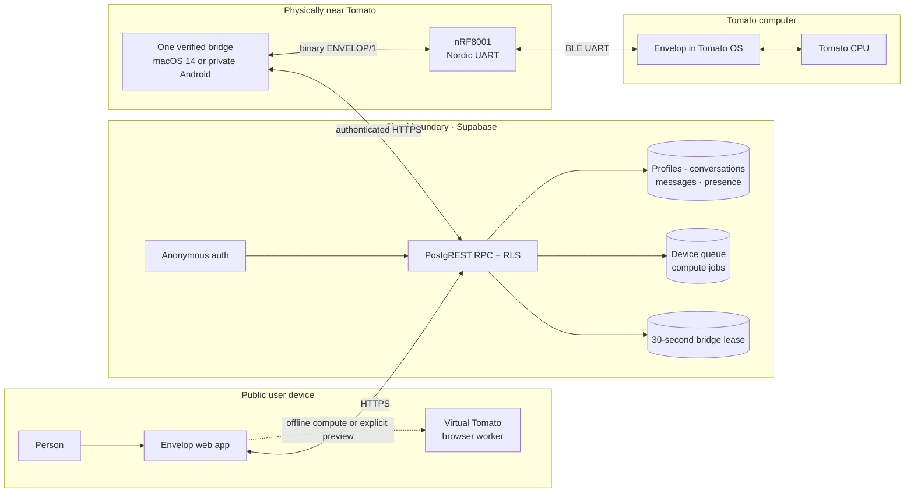
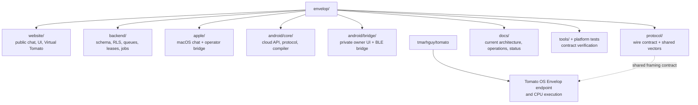
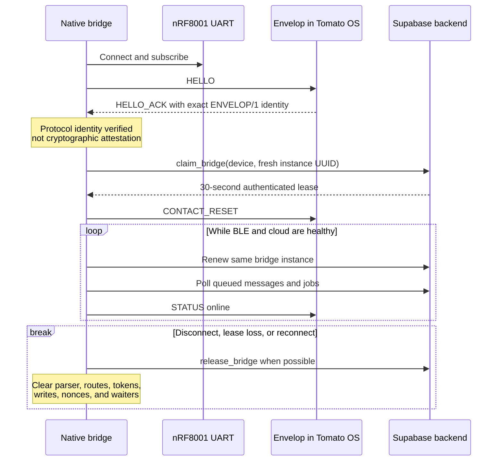
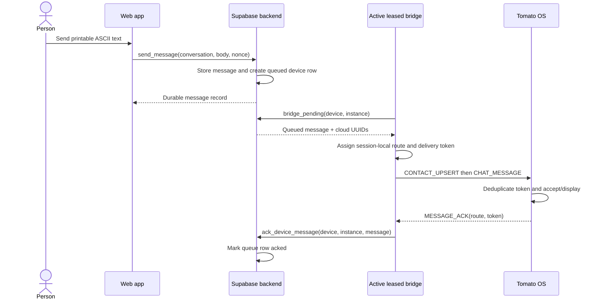
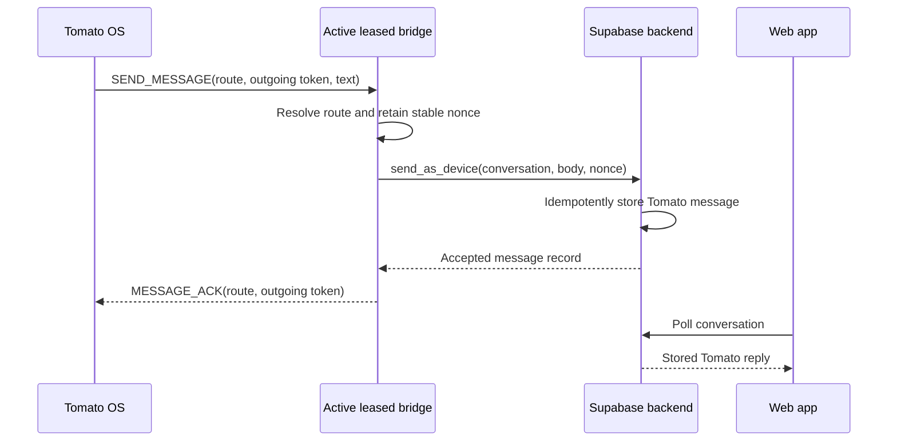
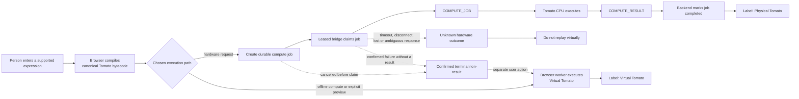
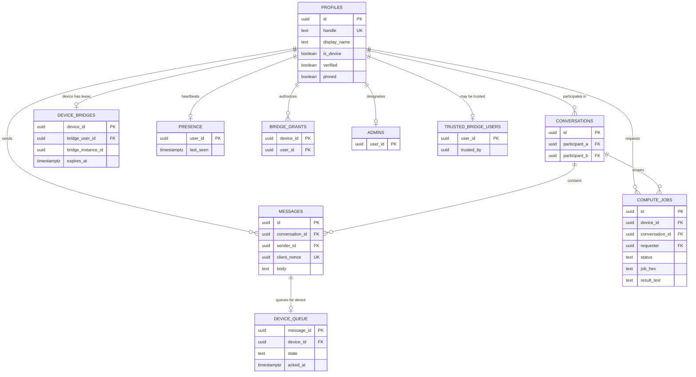
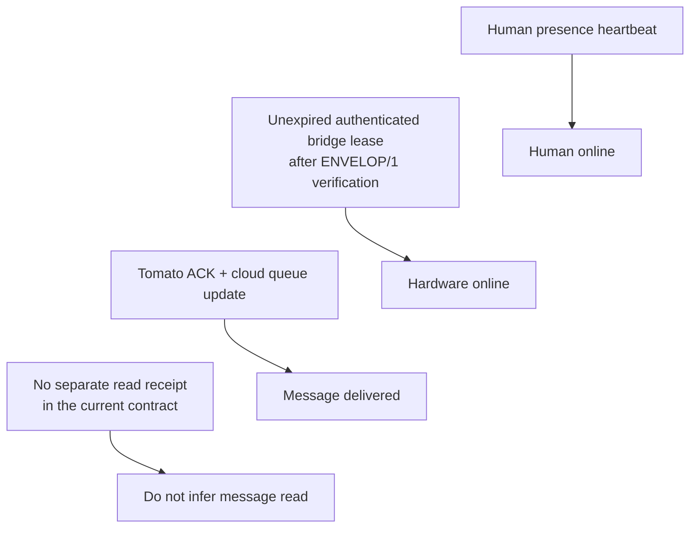

# Envelop architecture

Envelop surrounds Tomato with a browser client, a durable Supabase backend, one
nearby native bridge, and the compact binary `ENVELOP/1` device protocol.

[Open the generated repository graph in GitDiagram](https://gitdiagram.com/tmarhguy/envelop)
(repository access may be required), or use the maintained diagrams below to
follow the runtime contracts. The Tomato OS endpoint lives in the separate
[Tomato repository](https://github.com/tmarhguy/tomato).

## System context

The browser and backend never talk directly to the FPGA. Virtual Tomato is a
separate browser execution path, not a bridge and not a substitute result for
an ambiguous hardware operation.

## Repository ownership

The [documentation authority](documentation-policy.md) defines which source
wins when prose and implementation disagree. Dated files under `log/` explain
the project's evolution but are not current architecture.

## Bridge verification and lease

The physical radio and cloud lease solve different exclusivity problems: the
nRF8001 accepts one BLE connection, while the backend fences cloud operations
to one authenticated bridge instance.

A bridge account must already be operator-provisioned. Clients contain only the
Supabase HTTPS URL and public publishable/anonymous key; authorization comes
from backend grants, never from a bundled service-role key. The backend cannot
observe the BLE handshake itself; it trusts granted bridge software to verify
`ENVELOP/1` before requesting the lease.

## Human-to-Tomato delivery

Retries retain the same delivery token. If Tomato accepts a frame but the link
fails before the cloud acknowledgement is recorded, the message can be shown
again after resynchronization. Delivery is therefore **at least once** across
reconnect and power-loss boundaries; exactly-once display is not claimed.

Cloud UUIDs stop at the bridge. Only bounded routes, delivery tokens, and
printable ASCII text cross BLE.

The wire protocol also reserves `OPEN_CHAT` and `CHAT_HISTORY`, but current
native bridge handlers do not implement device-driven history synchronization.
The delivery sequence above describes queued live messages, not that unfinished
history path.

## Tomato-to-human delivery

The bridge acknowledges Tomato only after `send_as_device` succeeds. In either
direction, `MESSAGE_ACK` means protocol/backend acceptance—not that a person
read the message.

## Compute provenance

Only a completed backend hardware job can be labeled **Physical Tomato** or
**Hardware Tomato**. A queued or claimed job can outlive a browser request. If
its outcome becomes ambiguous, Envelop must not invent a result or replay it in
Virtual Tomato. Virtual execution remains visibly labeled and never enters the
hardware queue. Offline compute can select the virtual path immediately;
following a hardware attempt requires a separately chosen fallback and a
confirmed terminal non-result.

## Backend data model

`profiles`, conversations, messages, queue state, leases, presence, and compute
jobs are public-schema objects protected by RLS and RPC contracts. Bridge
grants, administrators, trusted bridge users, and reserved names live in the
private schema.

The sole schema file, `backend/migrations/001_envelop.sql`, drops and recreates
both schemas. It is a destructive reset, not an incremental migration; follow
the [deployment and recovery runbook](backend-deployment-recovery.md).

## State boundaries

These states are independent. In particular, a human heartbeat is not a bridge
lease, delivery is not read state, and checked-in source is not proof that
hardware is online.

## Evidence boundary

Shared vectors establish codec agreement. Local backend tests establish schema
contracts. Native tests establish source behavior. Tomato simulations establish
device behavior under their test setup. None alone proves that the hosted
backend, nearby bridge, and programmed FPGA are online with matching revisions.

Use [current status](status.md) for present-tense claims, [bridge
operations](bridge-operations.md) for acceptance procedures, and the [device
protocol](../protocol/ENVELOP_PROTOCOL.md) for exact frame fields and limits.
